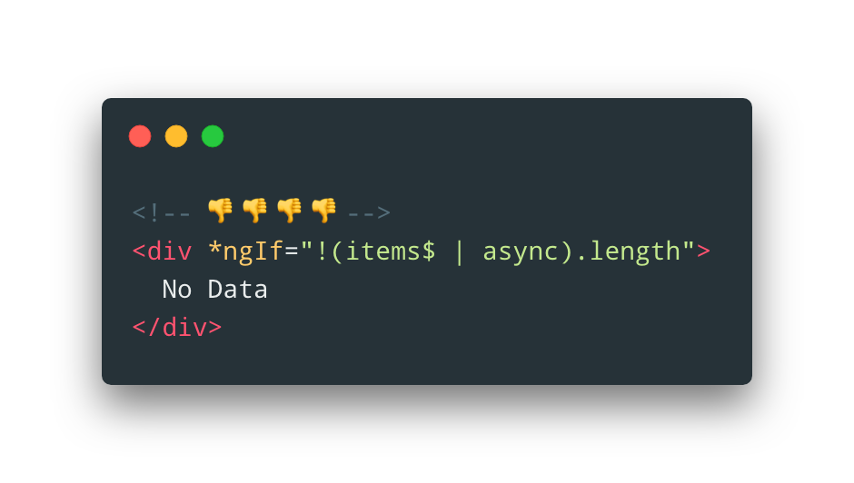
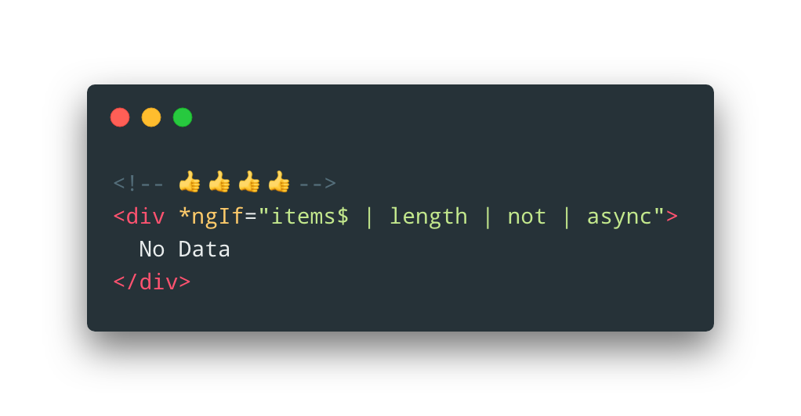

# AsyncPipeline

Do you still use streams in an old fashioned way? 🧐



Async pipeline bring **RxJS** operators in Angular templates! 🔥
Useful custom operators included!



## Getting started

- `npm i ngx-async-pipeline`
- Import required modules:

```typescript
import { CommonModule } from '@angular/common';
import { NotModule, LengthModule, SkipModule } from 'ngx-async-pipeline';

@NgModule({
  imports: [CommonModule, NotModule, LengthModule, SkipModule]
})
export class AppModule {}
```

- Use pipes

```html
<app-errors *ngIf="errors$ | skip:3 | length | not | async"></app-errors>
```

- Be awesome 🌈

## Available pipes

### Custom pipes

Here's a list of custom pipes introduced to bring simplicity and clarity to Angular templates.

- [length](#lengthpipe)
- [log](#logpipe)
- [not](#notpipe)
- [get](#getpipe)
- [isEmpty](#isemptypipe)

### RxJS

Here's a list of **RxJS** operators provided as pipes. Each **RxJS** pipe has the same API as appropriate operator.

- [debounce](https://rxjs.dev/api/operators/debounce)
- [debounceTime](#debouncetimepipe)
- [delay](#delaypipe)
- [distinctUntilChanged](#distinctuntilchangedpipe)
- [first](#firstpipe)
- [last](#lastpipe)
- [mapTo](#maptopipe)
- [pairwise](#pairwisepipe)
- [skip](#skippipe)
- [skipLast](#skiplastpipe)
- [skipUntil](https://rxjs.dev/api/operators/skipUntil)
- [skipWhile](https://rxjs.dev/api/operators/skipWhile)
- [take](#takepipe)
- [takeLast](#takelastpipe)
- [takeUntil](https://rxjs.dev/api/operators/takeUntil)
- [takeWhile](https://rxjs.dev/api/operators/takeWhile)
- [throttle](#throttlepipe)
- [throttleTime](https://rxjs.dev/api/operators/throttleTime)

## Custom pipes

### LengthPipe

```typescript
// app.module.ts
import { LengthModule } from 'ngx-async-pipeline';

@NgModule({
  imports: [LengthModule]
})
export class AppModule {}

// app.component.ts
@Component({
  template: `
    {{ title$ | length | async }}
  `
})
export class AppComponent {
  title$: Observable<string> = of('Hello, Async Pipeline!');
}
```

**length** operator has to be used to retrieve the length of the _string_ or _array_
**title\$ | length**.

### LogPipe

```typescript
// app.module.ts
import { LogModule } from 'ngx-async-pipeline';

@NgModule({
  imports: [LogModule]
})
export class AppModule {}

// app.component.ts
@Component({
  template: `
    {{ title$ | log | async }}
  `
})
export class AppComponent {
  title$: Observable<string> = of('Hello, Async Pipeline!');
}
```

**log** operator will _console.log_ each value from the stream
**title\$ | log**.

### NotPipe

```typescript
// app.module.ts
import { NotModule } from 'ngx-async-pipeline';

@NgModule({
  imports: [NotModule]
})
export class AppModule {}

// app.component.ts
@Component({
  template: `
    <div *ngIf="data$ | length | not | async">
      No Data
    </div>
  `
})
export class AppComponent {
  data$: Observable<string[]> = of([
    'Hello, Async Pipeline!',
    'Some another string',
    'And one more string',
    'And so on...'
  ]);
}
```

**not** operator will negate the value from the stream using **!** operator
**condition\$ | not**

### GetPipe

```typescript
// app.module.ts
import { GetModule } from 'ngx-async-pipeline';

@NgModule({
  imports: [GetModule]
})
export class AppModule {}

// app.component.ts
@Component({
  template: `
    {{ data$ | get: 'title' | async }}
  `
})
export class AppComponent {
  data$: Observable<{ title: string }> = of({ title: 'Here is a title!' });
}
```

Using **get** pipe you can get a value from an object by key provided as a param
**get:'title'**. Or, **get** could be used to retrieve a specific item from an array
**get:3**.

### IsEmptyPipe

```typescript
// app.module.ts
import { IsEmptyPipe } from 'ngx-async-pipeline';

@NgModule({
  imports: [IsEmptyModule]
})
export class AppModule {}

// app.component.ts
@Component({
  template: `
    {{ someArrayOrString$ | isEmpty | async }}
  `
})
export class AppComponent {
  someArrayOrString$: Observable<string> = of([1, 2, 3]);
}
```

**isEmpty** operator has to be used to retrieve if a _string_ or _array_ is empty (e.g. Array.length / String.length equals 0)
**arrayOrString\$ | isEmpty**.

## RxJS pipes

### DebounceTimePipe

```typescript
// app.module.ts
import { DebounceTimeModule } from 'ngx-async-pipeline';

@NgModule({
  imports: [DebounceTimeModule]
})
export class AppModule {}

// app.component.ts
@Component({
  template: `
    {{ title$ | debounceTime: 1000 | async }}
  `
})
export class AppComponent {
  title$: Observable<string> = of('Hello, Async Pipeline!');
}
```

[Official documentation for _debounceTime_ operator.](https://rxjs.dev/api/operators/debounceTime)

### DelayPipe

```typescript
// app.module.ts
import { DelayModule } from 'ngx-async-pipeline';

@NgModule({
  imports: [DelayModule]
})
export class AppModule {}

// app.component.ts
@Component({
  template: `
    {{ title$ | delay: 1000 | async }}
  `
})
export class AppComponent {
  title$: Observable<string> = of('Hello, Async Pipeline!');
}
```

[Official documentation for _delay_ operator.](https://rxjs.dev/api/operators/delay)

### DistinctUntilChangedPipe

```typescript
// app.module.ts
import { DistinctUntilChangedModule } from 'ngx-async-pipeline';

@NgModule({
  imports: [DistinctUntilChangedModule]
})
export class AppModule {}

// app.component.ts
@Component({
  template: `
    {{ title$ | distinctUntilChanged | async }}
  `
})
export class AppComponent {
  title$: Observable<string> = of('Hello, Async Pipeline!');
}
```

[Official documentation for _distinctUntilChanged_ operator.](https://rxjs.dev/api/operators/distinctUntilChanged)

### FirstPipe

```typescript
// app.module.ts
import { FirstModule } from 'ngx-async-pipeline';

@NgModule({
  imports: [FirstModule]
})
export class AppModule {}

// app.component.ts
@Component({
  template: `
    {{ title$ | first: 3 | async }}
  `
})
export class AppComponent {
  title$: Observable<string> = of('Hello, Async Pipeline!');
}
```

[Official documentation for _first_ operator.](https://rxjs.dev/api/operators/first)

### LastPipe

```typescript
// app.module.ts
import { LastModule } from 'ngx-async-pipeline';

@NgModule({
  imports: [LastModule]
})
export class AppModule {}

// app.component.ts
@Component({
  template: `
    {{ title$ | last: 3 | async }}
  `
})
export class AppComponent {
  title$: Observable<string> = of('Hello, Async Pipeline!');
}
```

[Official documentation for _last_ operator.](https://rxjs.dev/api/operators/last)

### MapToPipe

```typescript
// app.module.ts
import { MapToModule } from 'ngx-async-pipeline';

@NgModule({
  imports: [MapToModule]
})
export class AppModule {}

// app.component.ts
@Component({
  template: `
    {{ title$ | mapTo: 'some other string' | async }}
  `
})
export class AppComponent {
  title$: Observable<string> = of('Hello, Async Pipeline!');
}
```

[Official documentation for _mapTo_ operator.](https://rxjs.dev/api/operators/mapTo)

### PairwisePipe

```typescript
// app.module.ts
import { PairwiseModule } from 'ngx-async-pipeline';

@NgModule({
  imports: [PairwiseModule]
})
export class AppModule {}

// app.component.ts
@Component({
  template: `
    {{ title$ | pairwise | async }}
  `
})
export class AppComponent {
  title$: Observable<string> = of('Hello, Async Pipeline!');
}
```

[Official documentation for _pairwise_ operator.](https://rxjs.dev/api/operators/pairwise)

### SkipPipe

```typescript
// app.module.ts
import { SkipModule } from 'ngx-async-pipeline';

@NgModule({
  imports: [SkipModule]
})
export class AppModule {}

// app.component.ts
@Component({
  template: `
    {{ title$ | skip: 3 | async }}
  `
})
export class AppComponent {
  title$: Observable<string> = of('Hello, Async Pipeline!');
}
```

[Official documentation for _skip_ operator.](https://rxjs.dev/api/operators/skip)

### SkipLastPipe

```typescript
// app.module.ts
import { SkipLastModule } from 'ngx-async-pipeline';

@NgModule({
  imports: [SkipLastModule]
})
export class AppModule {}

// app.component.ts
@Component({
  template: `
    {{ title$ | skipLast: 3 | async }}
  `
})
export class AppComponent {
  title$: Observable<string> = of('Hello, Async Pipeline!');
}
```

[Official documentation for _skipLast_ operator.](https://rxjs.dev/api/operators/skipLast)

### TakePipe

```typescript
// app.module.ts
import { TakeModule } from 'ngx-async-pipeline';

@NgModule({
  imports: [TakeModule]
})
export class AppModule {}

// app.component.ts
@Component({
  template: `
    {{ title$ | take: 3 | async }}
  `
})
export class AppComponent {
  title$: Observable<string> = of('Hello, Async Pipeline!');
}
```

[Official documentation for _take_ operator.](https://rxjs.dev/api/operators/take)

### TakeLastPipe

```typescript
// app.module.ts
import { TakeLastModule } from 'ngx-async-pipeline';

@NgModule({
  imports: [TakeLastModule]
})
export class AppModule {}

// app.component.ts
@Component({
  template: `
    {{ title$ | takeLast: 3 | async }}
  `
})
export class AppComponent {
  title$: Observable<string> = of('Hello, Async Pipeline!');
}
```

[Official documentation for _takeLast_ operator.](https://rxjs.dev/api/operators/takeLast)

### ThrottlePipe

```typescript
// app.module.ts
import { ThrottleModule } from 'ngx-async-pipeline';

@NgModule({
  imports: [ThrottleModule]
})
export class AppModule {}

// app.component.ts
@Component({
  template: `
    {{ title$ | throttle: 1000 | async }}
  `
})
export class AppComponent {
  title$: Observable<string> = of('Hello, Async Pipeline!');
}
```

[Official documentation for _throttle_ operator.](https://rxjs.dev/api/operators/throttle)

## How can I support the developer?

- Create pull requests, submit bugs, suggest new features or documentation updates 🔧
- Star my GitHub repos ⭐️
- Read me on [Medium](https://medium.com/@nik.poltoratsky)
- Follow me on [Twitter](https://twitter.com/nikpoltoratsky) 🐾
